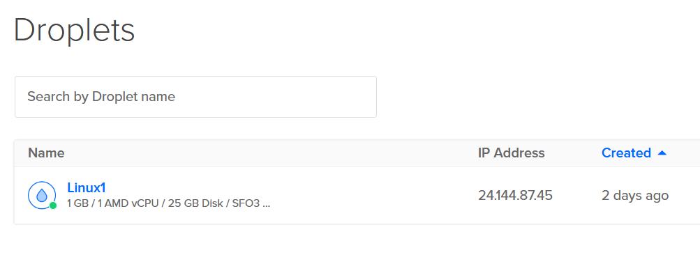

 <!-- - Create SSH keys on your local machine.
    - Add a custom Arch Linux image using the web console
    - Create a Droplet running Arch Linux using the Digital Ocean web console.
    - Use a cloud-init configuration file to automate initial setup tasks (e.g., user -->
# <center> Creating and using Arch Linux Droplets. </center>
#### <center> By Michael Flood</center>

## <center>Table of Contents</center>

1. [Creating SSH keys on your local machine](#creating-ssh-keys-on-your-local-machine)

2. [Download and upload your Operating System Image](#download-and-upload-your-operating-system-image)

3. [Creating your first Droplet](#creating-your-first-droplet)

4. [Creating and Using a Cloud Init File](#creating-and-using-a-cloud-init-file) 

5. [Logging into your Droplet](#logging-into-your-droplet)

6. [References](#references)


### <center> Creating SSH keys on your ***local*** machine.</center>
---
> {!NOTE}
> SSH keys are an authentication tool that acts as a special password, mainly used for connecting to a remote computer.

---
<br>
<br>

1. create a new folder named .ssh in a directory of your choosing.


<br>
<br>

2. Open up your windows terminal and input the below text, changing **~/.ssh/do-key** to your .ssh folders path. and **your email** to your preferred email account.
<br>
<br>

     > [!IMPORTANT]
    > if you are on windows you will need to use your full path. i.e.  
    > C:\Users\your-user-name\.ssh\do-key
<br>
<br>

```bash
    ssh-keygen -t ed25519 -f ~/.ssh/do-key -C <youremail@email.com>
```
<br>
<br>

3. You will be given the choice of either having a password or not.
    * typing ** Enter ** twice will result in you having no password for your SSH key.

<br>
<br>

    * Whatever you enter into the field will become your password going forward.
4. visit Digital Ocean and navigate to the **settings** menu which is located in the lefthand side of your screen.

<center>  </center>

<br>
<br>

5. Click the security tab at the top of your page
<br>
<br>
<center>
 </center>

<br>
<br>

6. click add SSH key and paste the contents of you do-key.pub into the first box and make an easy to remember name for the second box.

> [!Note]
> To get your do-key.pub info run this command into your terminal ***change path***

```bash
Get-Content C:\Users\your-user-name\.ssh\do-key.pub | Set-Clipboard
```

<br>
<br>

    > [!TIP]
     > make the name simple, it is used later.

<br>
<br>

### <center> download and upload your Operating System Image <center>
<br>
<br>

---


> [!NOTE]
>in order to have a functional environment to work with we need to choose and upload an image of whatever OS we want to play with. I will be demonstrating with Arch Linux.

---
<br>
<br>

1. navigate to the following link.

    * <a href="https://gitlab.archlinux.org/archlinux/arch-boxes/-/packages" target="_blank" rel="noopener noreferrer">Arch Linux gitlab Repo</a>
    <br>
<br>


2. Open the most **recently** published images link.
<br>
<br>

3. We want to download the cloudimg qcow2 link.
<br>
<br>

<center>  </center>

<br>
<br>

    * > [!NOTE]
    > we choose the cloudimg qcow2 due to the fact  that we get cloud compatibility(cloudimg), it is easy to create backups for qcow2 images, and because qcow2 is optimised for reading and writing speeds.

4. Go to Digital Ocean and click on the ***Manage*** button on the left-hand side, a drop down will appear, and you will select ***Backups & Snapshots***
<br>
<br>
    * <center>  </center>

5. Click ***Custom Images***
    * Click the Blue ***Upload Image*** Button
    * Select the Arch Linux Cloudimg qcow2 we downloaded previously

    <center>  </center>

     <br>
<br>

6. Image Options
    * Choose the Arch Linux Distribution
    * Select the Data Center closest to you in my case it will be *San Francisco 3*
    * You should see that your upload is in progress or **Pending** This will resolve shortly.
<br>
<br>

### <center> Creating your first droplet <center>
<br>
<br>

---
> [!NOTE]
> Droplets are similar to running a virtual machine on your computer with the exception that we deploy the Virtual Machine (Droplet) through Digital Oceans cloud servers negating the need for our own hardware to do any work. The Trade off is that we spend monthly amounts for our active droplets. You may have also heard them called Virtual Private Servers
---

<br>
<br>
---

> [!IMPORTANT]
> You pay for all services while using Digital Ocean.

<br>
<br>

---

1.  Go to Digital Ocean and Click the ***Manage*** button on the left-hand side, a drop down will appear click on ***Droplets***
<br>
<br>

<center> Droplets" > </center>

2. Click ***Create Droplet***

3. **Droplet Settings**
    * Choose Region: <br>
     closest to you for optimal performance. 
     <br>
     <br>
    * Choose an Image : <br>
    Custom images
        * Choose the Arch Linux Image we uploaded earlier
        <br>
        <br>

    * Choose Size:  <br>
    Base your Droplet Type off of your needs, in my case i will be running a low resource Droplet so i pick the ***Basic Plan + Regular SSD + $7/Month***
    <br>
    <br>

    * Authentication Method :<br>
     Choose SSH Key : <br>
      use the one we uploaded earlier.

    * Change your hostname to something easy to type, the project you are working on is a good choice.
    <br>
    <br>

    >[!IMPORTANT]
    > If you are planning to add a cloud init Config to this droplet please complete section 4:[Creating and Using a Cloud Init File](#creating-and-using-a-cloud-init-file) first.

    * Under Advanced options click the ***Add Initialization scripts*** button and paste your yaml here.

    <center>  </center>

<br>
    <br>

    > [!NOTE]
    > You can leave the rest of the settings on Defaults.

<br>
<br>

4. Click Create Droplet. You should see the Droplet you just made now.

<center> </center>

<br>
    <br>

### <center> Creating and Using a Cloud Init FIle <center>
<br>
    <br>

---
>[!NOTE]
> Cloud Init is pre-installed in the Arch Linux Cloudimg images. With the help of a config file users are able to make changes to their initial server. installing specific packages or adding users etcetc.
<br>
<br>
--- 

1.  Using a text editor or app create a file.
    * The text we put into this file will be the instructions that our Droplet initializes with.

    ---
<br>
<br>

2. There are many things you can do with cloud-init-config files we will be going simple.
```yaml 
# cloud-config
# Create a user ID
users:
    - name: YourName
    groups: sudo
    shell: /bin/bash # default shell
    ssh-authorized-keys: 
        - ssh-ed25519 # enter your do-key.pub files contents
    sudo: 
        ["ALL=(ALL) NOPASSWD:ALL"] # allows useage of sudo command without needing a password
    packages: # install whatever packages you may want.
        - git
        - neovim
    ssh_pwauth: false # disables password authentication for ssh
    diable_root: true # disables root login for ssh
```
<br>
<br>

3. adding this data into the add initialization scripts option during droplet creation will make the droplet launch with.
    * Neo Vim and Git installed
    * a user with:<br>
        * a preset ssh key
        * a chosen name by the user
        * Sudo privelages


### <center> Logging into your Droplet </center>
---
---

1.  Run the following command into your terminal.


```bash
ssh -i .ssh/do-key arch@your-droplets-ip-address
# arch is your username so it may change
# get your droplet ip from the digital ocean droplet page
```


2. If a password was set up you will need to enter it in

---
<br>

<br>

<br>

<br>

<br>

<br>

<br>

<br>

<br>

<br>

<br>

<br>

<br>

<br>

---


#### <center> References </center>
- cloudbees. -yaml - https://www.cloudbees.com/blog/yaml-tutorial-everything-you-need-get-started

- Cyberpanel.  - droplets - https://cyberpanel.net/blog/digitalocean-droplets

- DigitalOcean. - ssh keys - https://docs.digitalocean.com/products/droplets/how-to/add-ssh-keys/

- DigitalOcean.  - custom images - https://docs.digitalocean.com/products/custom-images/

- DigitalOcean. - cloud init -  https://docs.digitalocean.com/glossary/cloud-init/

- Proffessor Nathan McNinch ( I dont wanna link your notes here because i don't know if that gets tagged as privacy violation. but i went through all the notes to get some of my info)